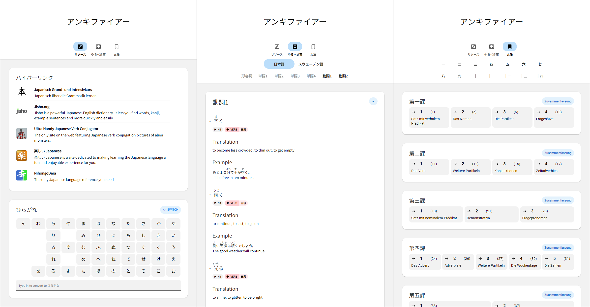

# Ankifier

Welcome to **Ankifier**! This project is designed to provide language learners, particularly those interested in Japanese, with a suite of tools and resources to aid their studies.

## Introduction

**Ankifier** is a collection of tools and resources that cater to language learners. The primary focus is on Japanese, but the project also has provisions for other languages. It aims to provide a streamlined and effective learning experience by offering a variety of features and resources.

## Features

   1. **Resources Page:**
   - Romaji-to-Kana Converter: A tool to convert Romanized Japanese text into kana characters using Wanakana.
   - Useful Links: Curated collection of links to high-quality resources about Japanese grammar.

   2. **Flashcard Viewer:**
   - An flashcard viewer inspired by Anki, designed to help learners review vocabulary.
   - Supports various languages, including Japanese and others.

   3. **Grammar Topics:**
   - Organized list of important grammar concepts.
   - Each topic includes a link to an in-depth explanation of the grammar concept.
   - Links to specific pages in a personalized handbook for additional context and examples.

These features collectively provide a comprehensive set of tools and resources for language learners, with a primary focus on Japanese but also extending to other languages.

## Screenshots

## License

This project is licensed under the [MIT License](LICENSE). Feel free to use, modify, and distribute the code as per the terms of the license.